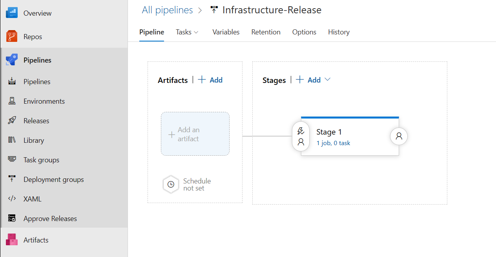
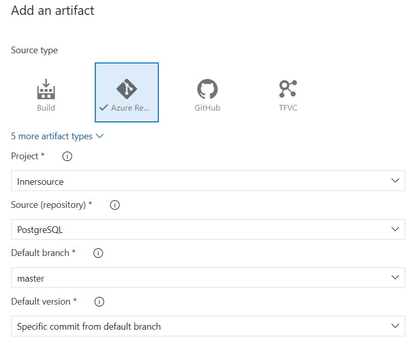
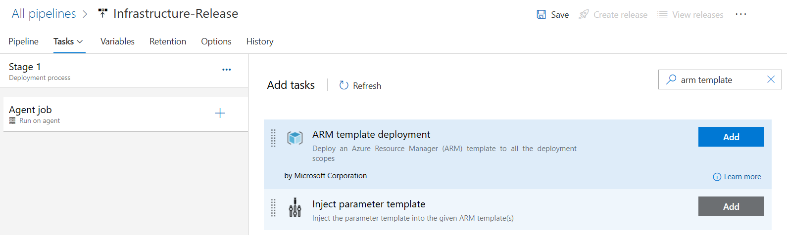
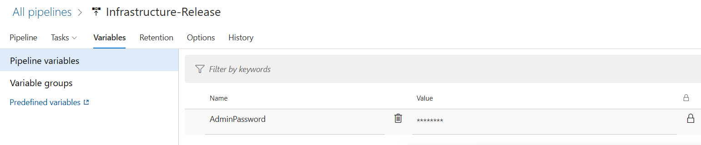

[[_TOC_]]

# Introduction
This repo contains templates that can be used to create various database services in Azure.

# Available templates
- MariaDB
- Postgres (single server SKU)
- Postgres (flexible server SKU)

Detailed documentation on each template can be found in the corresponding template folder.

## Service retirement notices
- In March 2023, Microsoft announced it will gradually retire the Postgres single server SKU. As a result, you are advised to use the flexible server SKU for any new Postgres servers

# How to: consume the template
You'll need to decide if you want to:
- grab a **copy of the relevant files** from this repo and store it in your project's code repository for deploying later; _or_
- **import this repo in its entirety** into your infrastructure deployment pipeline

_We recommend option two but there may be times where option one is more appropriate._

# How to: deploy the template
You'll need to decide if you want to:
- deploy using a YAML pipeline
- deploy using a classic release pipeline

_Although we recommend YAML pipelines, you may find it easier to use classic release pipelines if this is your first time deploying infrastructure through Azure DevOps_ 

## YAML pipelines
Use the starter pipeline `docs/yaml/sample-azure-pipelines.yml` as a reference.

## Classic release pipelines
### Create your classic release pipeline
Create your initial pipeline, and setup as many stages as required (typically one stage per environment) and setup any variables that may be required too.

### Add artifacts
You now need to connect the pipeline to an artifact by selecting the **Add an artifact** option.


This will present you with an option to either connect to a build artifact or a Git repo artifact.

**PRO TIP:** When importing, set the 'Default version' to a specific commit/build instead of Latest.



### Add task
Add the **ARM template deployment** task to your stage(s)


Use the following table for guidance on what the inputs for the task should look like. Leave all other inputs unchanged.

| Input name | Description |
| --- | --- |
| **Deployment scope** | Resource group |
| **Azure Resource Manager connection** | _Pick your service connection_ |
| **Subscription** | _Pick your subscription_ |
| **Action** | Create or update resource group |
| **Resource group** | _Pick your resource group_ |
| **Location** | _Pick your deployment region_ |
| **Template location** | Linked artifact |
| **Template** | _Path to your template file - e.g. `server.bicep`_ |
| **Template parameters** | _Path to your parameters file - e.g. `parameters.nonprod.json`_ |
| **Override template parameters** | _use this for any sensitive values like passwords_ |


### Sensitive values
For sensitive values like admin passwords, instead of specifying them in plaintext in your parameter files, you can pass them as secure string variables.

To do this, you need to add a variable in your pipeline (e.g. `AdminPassword`) and **make sure to press the padlock icon to redact the value**.


Then, go back to your ARM template task, and in the **Override template parameters** input, enter as follows:

````
-serverAdminPassword "$(AdminPassword)"
````

In this example, the
- `serverAdminPassword` is the **name of the parameter** from your template
- `AdminPassword` is the **name of the variable** from your pipeline

Also note how
- the parameter name is prepended with a `-`
- the variable name is prepended with `"$(` and appended with a `)"`

# Contribute
Found a bug? Want to add an enhancement? 

We welcome any and all contributions! 

Get in touch with us at DG-CloudEngineering@StoneX.com
